<h2>Tensorflow-Image-Segmentation-Augmented-Breast-Cancer (2024/02/25)</h2>

This is the second experimental Image Segmentation project for Breast-Cancer based on
the <a href="https://github.com/sarah-antillia/Tensorflow-Image-Segmentation-API">Tensorflow-Image-Segmentation-API</a>, and
<a href="https://drive.google.com/file/d/1SafNtMgHlr_0fludiIxpaRNqwA7muQKr/view?usp=sharing">
BUS-BRA-ImageMask-Dataset.zip</a>.
 
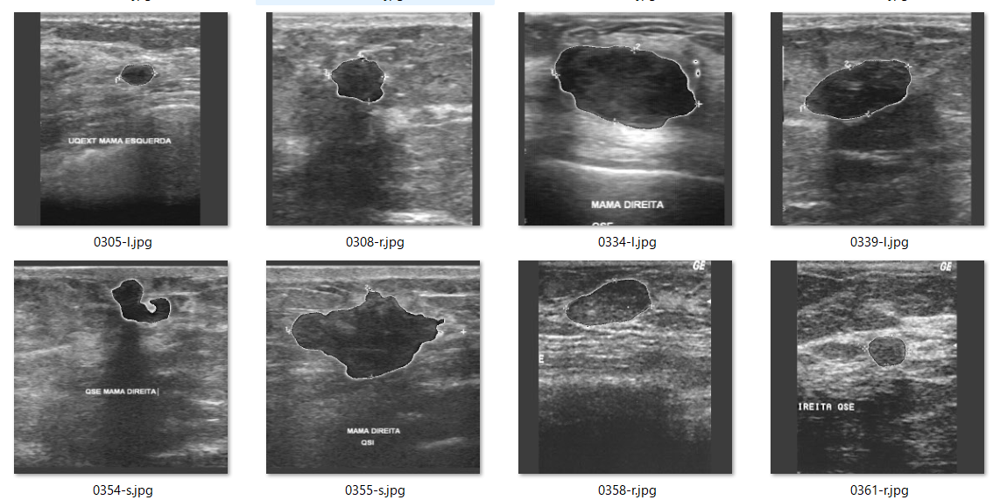
 

In order to improve segmentation accuracy, we will use an online dataset augmentation strategy based on Python script <a href="./src/ImageMaskAugmentor.py">
ImageMaskAugmentor.py</a> to train a Pancreas Segmentation Model.  
Please see also our first experiment 
<a href="https://github.com/atlan-antillia/Image-Segmentation-Breast-Cancer">Image-Segmentation-Breast-Cancer</a>
 
 
As a first trial, we use the simple UNet Model 
<a href="./src/TensorflowUNet.py">TensorflowSlightlyFlexibleUNet</a> for this Breast-Cancer Segmentation. 
As shown in <a href="https://github.com/sarah-antillia/Tensorflow-Image-Segmentation-API">Tensorflow-Image-Segmentation-API</a>.
you may try other Tensorflow UNet Models: 

<li><a href="./src/TensorflowSwinUNet.py">TensorflowSwinUNet.py</a></li>
<li><a href="./src/TensorflowMultiResUNet.py">TensorflowMultiResUNet.py</a></li>
<li><a href="./src/TensorflowAttentionUNet.py">TensorflowAttentionUNet.py</a></li>
<li><a href="./src/TensorflowEfficientUNet.py">TensorflowEfficientUNet.py</a></li>
<li><a href="./src/TensorflowUNet3Plus.py">TensorflowUNet3Plus.py</a></li>
 

<h3>1. Dataset Citation</h3>

The orginal BUS-BRA dataset used here has been taken from the following web site. 
<a href="https://zenodo.org/records/8231412"><b>BUS-BRA: A Breast Ultrasound Dataset for Assessing Computer-aided Diagnosis Systems</b>
</a>
 
Wilfrido Gómez-Flores, Maria Julia Gregorio-Calas, 
Wagner Coelho de Albuquerque Pereira 

<pre>
The BUS-BRA Dataset is a publicly available dataset of anonymized breast ultrasound (BUS) images of 1,064 patients 
that underwent routinary breast studies. The BUS dataset contains biopsy-proven tumor cases and BI-RADS annotations 
in categories 2, 3, 4, and 5. In addition, the dataset also contains ground truth delineations that divide the BUS 
images into tumoral and normal regions. A full description of the BUS-BRA dataset can be found in the following article:

Wilfrido Gómez-Flores, Maria Julia Gregorio-Calas, and Wagner Coelho de Albuquerque Pereira, 
"BUS-BRA: A Breast Ultrasound Dataset for Assessing Computer-aided Diagnosis Systems," Medical Physics, 2023. (In revision)

Any research originating from its usage is required to cite this paper.

The Program of Biomedical Engineering of the Federal University of Rio de Janeiro (PEB/COPPE-UFRJ, Brazil) has a copyright 
on the data and is the principal distributor of the BUS-BRA Dataset. In addition, the Centro de Investigación y de Estudios
 Avanzados (Cinvestav, Mexico) is involved in an ongoing effort to develop this dataset to aid research efforts in developing, 
 testing, and evaluating algorithms for breast ultrasound analysis.
</pre>

<h3>
<a id="2">
2 Breast-Cancer ImageMask Dataset
</a>
</h3>
 If you would like to train this Breast-Cancer Segmentation model by yourself,
please download the dataset from the google drive 
<a href="https://drive.google.com/file/d/1SafNtMgHlr_0fludiIxpaRNqwA7muQKr/view?usp=sharing">
BUS-BRA-ImageMask-Dataset.zip</a>.

Please see also the <a href="https://github.com/sarah-antillia/BUS-BRA-ImageMask-Dataset">BUS-BRA-ImageMask-Dataset</a>. 
Please expand the downloaded ImageMaskDataset and place them under <b>./dataset</b> folder to be

<pre>
./dataset
└─BUS-BRA
    ├─test
    │  ├─images
    │  └─masks
    ├─train
    │  ├─images
    │  └─masks
    └─valid
        ├─images
        └─masks
</pre>
 
 
<b>BUS-BRA Dataset Statistics</b> 
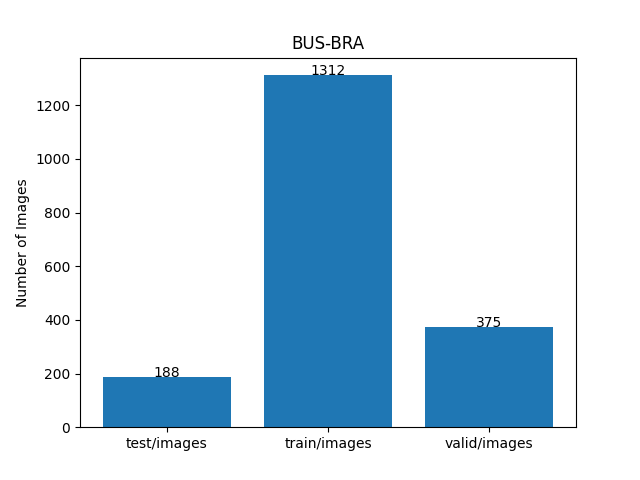 

As shown above, the number of images of train and valid dataset is not necessarily large. Therefore the online dataset augmentation strategy may 
be effective to improve segmentation accuracy.

 

<h3>
<a id="3">
3 TensorflowSlightlyFlexibleUNet
</a>
</h3>
This <a href="./src/TensorflowUNet.py">TensorflowUNet</a> model is slightly flexibly customizable by a configuration file. 
For example, <b>TensorflowSlightlyFlexibleUNet/Breast-Cancer</b> model can be customizable
by using <a href="./projects/TensorflowSlightlyFlexibleUNet/Augmented-Breast-Cancer/train_eval_infer.config">train_eval_infer.config</a>
<pre>
; train_eval_infer.config
; Pancreas, GENERATOR_MODE=True
; 2024/02/24 (C) antillia.com
; 2024/02/24 Modified to use 
; loss           = "bce_dice_loss"

[model]
generator     = True
image_width    = 512
image_height   = 512
image_channels = 3
num_classes    = 1
base_filters   = 16
base_kernels   = (5,5)
num_layers     = 7
dropout_rate   = 0.08
learning_rate  = 0.0001
clipvalue      = 0.5
dilation       = (2,2)
;loss           = "bce_iou_loss"
loss           = "bce_dice_loss"
metrics        = ["binary_accuracy"]
show_summary   = False

[train]
epochs        = 100
batch_size    = 4
steps_per_epoch  = 200
validation_steps = 100
patience      = 10
;metrics       = ["iou_coef", "val_iou_coef"]
metrics       = ["binary_accuracy", "val_binary_accuracy"]
model_dir     = "./models"
eval_dir      = "./eval"
image_datapath = "../../../dataset/BUS-BRA/train/images/"
mask_datapath  = "../../../dataset/BUS-BRA/train/masks/"
create_backup  = False
learning_rate_reducer = False
save_weights_only = True

[eval]
image_datapath = "../../../dataset/BUS-BRA/valid/images/"
mask_datapath  = "../../../dataset/BUS-BRA/valid/masks/"

[test] 
image_datapath = "../../../dataset/BUS-BRA/test/images/"
mask_datapath  = "../../../dataset/BUS-BRA/test/masks/"

[infer] 
images_dir    = "../../../dataset/BUS-BRA/test/images/"
output_dir    = "./test_output"
merged_dir    = "./test_output_merged"

[segmentation]
colorize      = False
black         = "black"
white         = "green"
blursize      = None

[mask]
blur      = True
blur_size = (5,5)
binarize  = True
#threshold = 128
threshold = 74

[generator]
debug     = True
augmentation   = True

[augmentor]
vflip    = False
hflip    = True
rotation = True
angles   = [5, 10,]
shrinks  = [0.8]
shears   = [0.2]
transformer = True
alpah       = 1300
sigmoid     = 8
</pre>

Please note that the online augementor 
<a href="./src/ImageMaskAugmentor.py">
ImageMaskAugmentor.py</a> reads the parameters in [generator] and [augmentor] sections, and yields some images and mask depending on the batch_size,
 which are used for each epoch of the training and evaluation process of this UNet Model. 
<pre>
[augmentor]
vflip    = False
hflip    = True
rotation = True
angles   = [5, 10,]
shrinks  = [0.8]
shears   = [0.2]
transformer = True
alpah       = 1300
sigmoid     = 8
</pre>
Depending on these parameters in [augmentor] section, it will generate hflipped, rotated, shrinked,
sheared, elastic-transformed images and masks
from the original images and masks in the folders specified by image_datapath and mask_datapath in 
[train] and [eval] sections. 
<pre>
[train]
image_datapath = "../../../dataset/BUS-BRA/train/images/"
mask_datapath  = "../../../dataset/BUS-BRA/train/masks/"
[eval]
image_datapath = "../../../dataset/BUS-BRA/valid/images/"
mask_datapath  = "../../../dataset/BUS-BRA/valid/masks/"
</pre>

For more detail on ImageMaskAugmentor.py, please refer to
<a href="https://github.com/sarah-antillia/Image-Segmentation-ImageMaskDataGenerator">
Image-Segmentation-ImageMaskDataGenerator.</a>.
    
 

<h3>
3.1 Training
</h3>
Please move to a <b>./projects/TensorflowSlightlyFlexibleUNet/Augmented-Breast-Cancer</b> folder, 
and run the following bat file to train TensorflowUNet model for Breast-Cancer. 
<pre>
./1.train_generator.bat
</pre>
, which simply runs <a href="./src/TensorflowUNetGeneratorTrainer.py">TensorflowUNetGeneratorTrainer.py </a>
in the following way.

<pre>
python ../../../src/TensorflowUNetGeneratorTrainer.py ./train_eval_infer.config
</pre>
Train console output: 
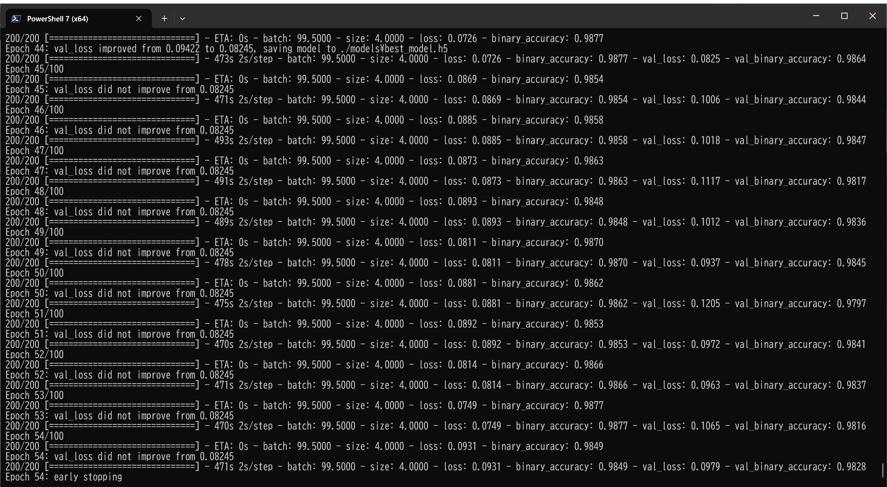 
Train metrics: 
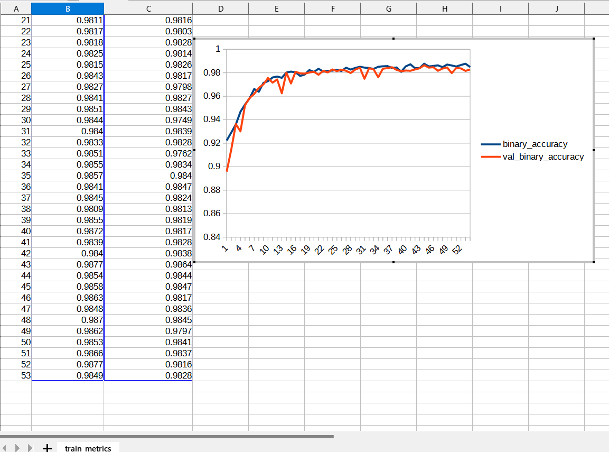 
Train losses: 
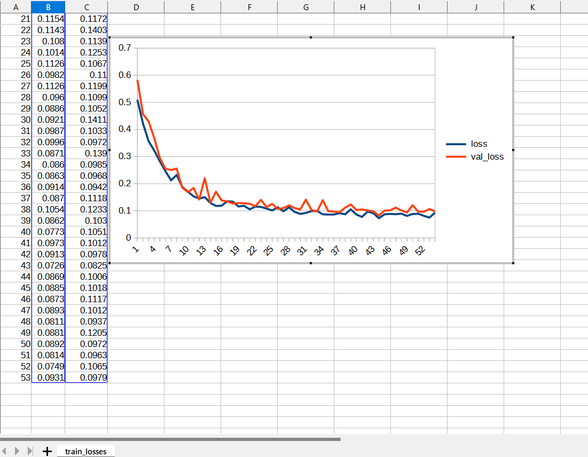 
 
The following debug setting is helpful whether your parameters in [augmentor] section are good or not good.
<pre>
[generator]
debug     = True
</pre>
You can check the yielded images and mask files used in the actual train-eval process in the following folders under
<b>./projects/TensorflowSlightlyFlexibleUNet/Augmented-Breast-Cancer/</b>.  
<pre>
generated_images_dir
generated_masks_dir
</pre>

Sample images in generated_images_dir 
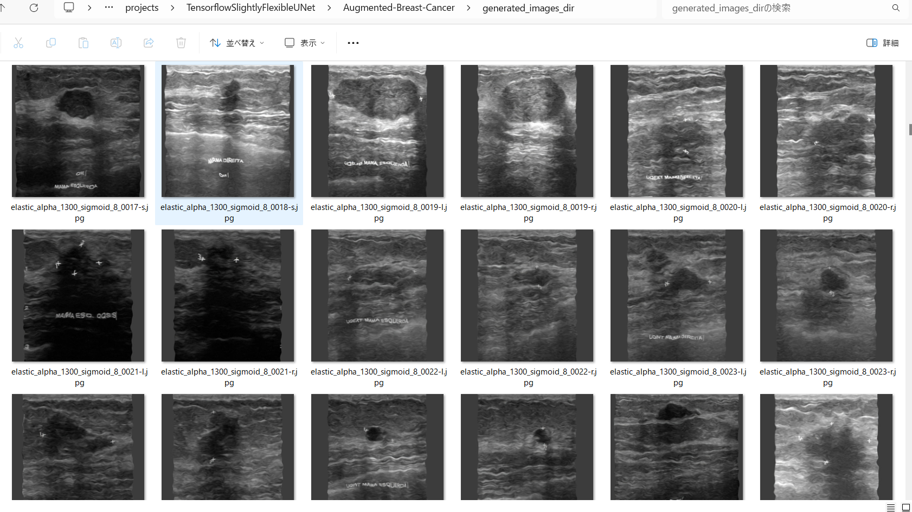 
Sample masks in generated_masks_dir 
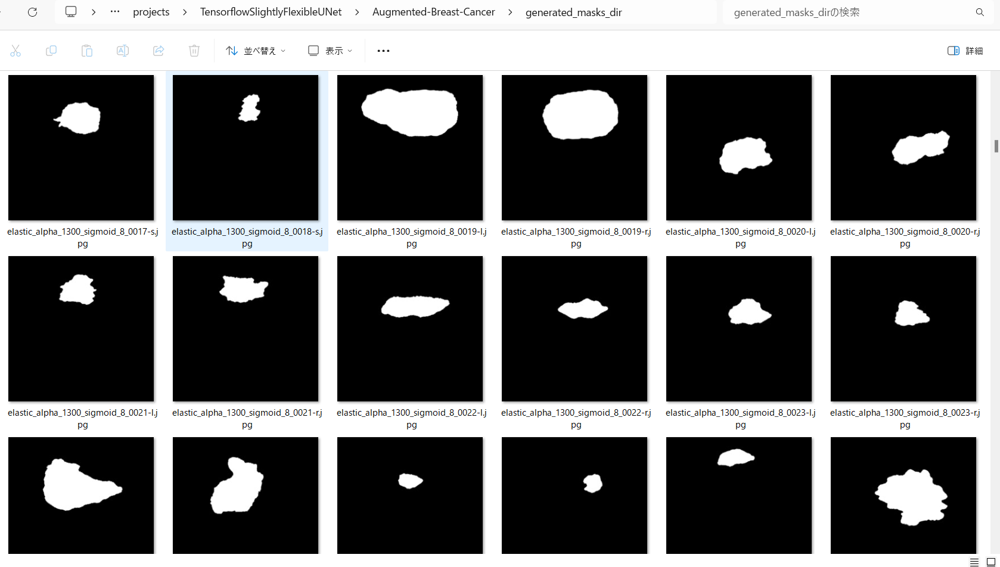 

<h3>
3.2 Evaluation
</h3>
Please move to a <b>./projects/TensorflowSlightlyFlexibleUNet/Augmented-Breast-Cancer</b> folder, 
and run the following bat file to evaluate TensorflowUNet model for Breast-Cancer. 
<pre>
./2.evaluate.bat
</pre>
<pre>
python ../../../src/TensorflowUNetEvaluator.py ./train_eval_infer_aug.config
</pre>
Evaluation console output: 
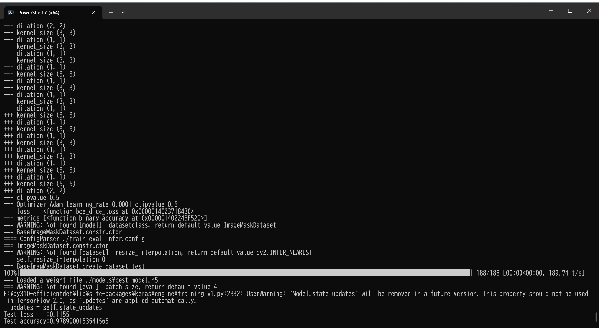

<pre>
Test loss    :0.1155
Test accuracy:0.9789000153541565</pre>

<h2>
3.3 Inference
</h2>
Please move to a <b>./projects/TensorflowSlightlyFlexibleUNet/Augmented-Breast-Cancer</b> folder 
,and run the following bat file to infer segmentation regions for images by the Trained-TensorflowUNet model for Breast-Cancer. 
<pre>
./3.infer.bat
</pre>
<pre>
python ../../../src/TensorflowUNetInferencer.py ./train_eval_infer_aug.config
</pre>
Sample test images 
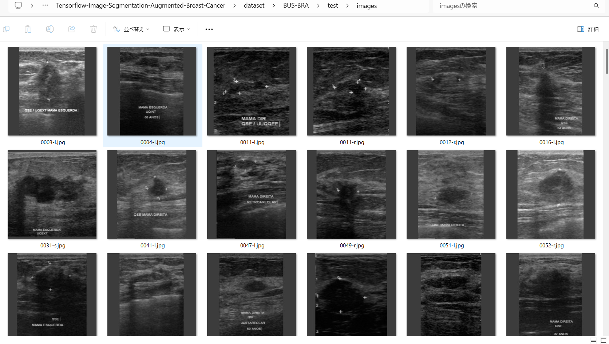 
Sample test mask (ground_truth) 
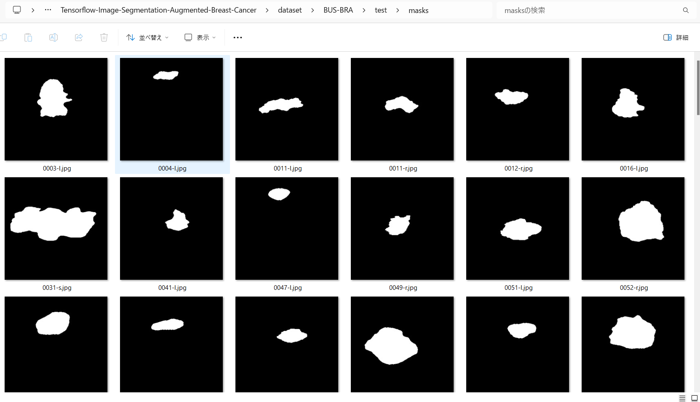 

 
Inferred test masks 
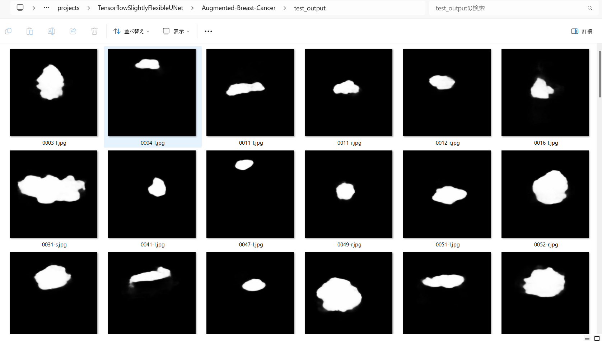 
 
Merged test images and inferred masks  
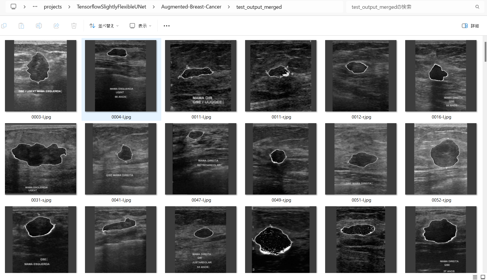  

Enlarged samples 
<table>
<tr>
<td>
test/images/0003-l.jpg 
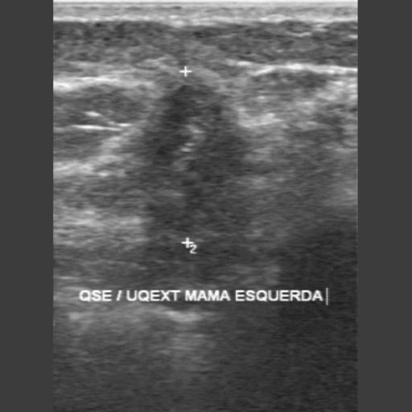

</td>
<td>
Inferred merged/10040_HFH_017.jpg 
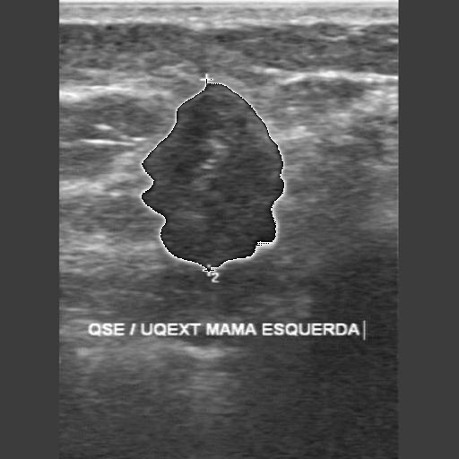
</td> 
</tr>

<tr>
<td>
test/images/0031-s.jpg 
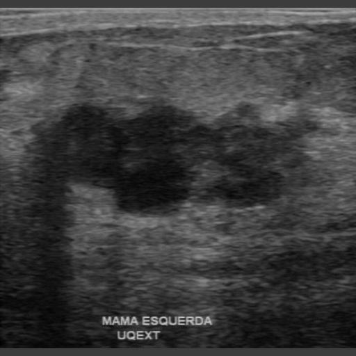

</td>
<td>
Inferred merged/0031-s.jpg 
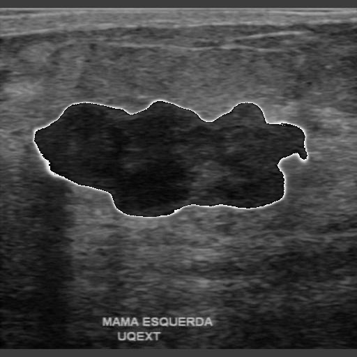
</td> 
</tr>

<tr>
<td>
test/images/0079-l.jpg 
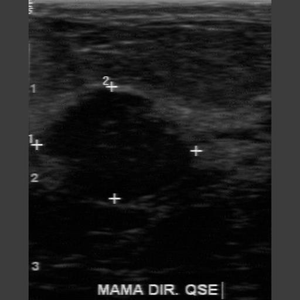

</td>
<td>
Inferred merged/0079-l.jpg 
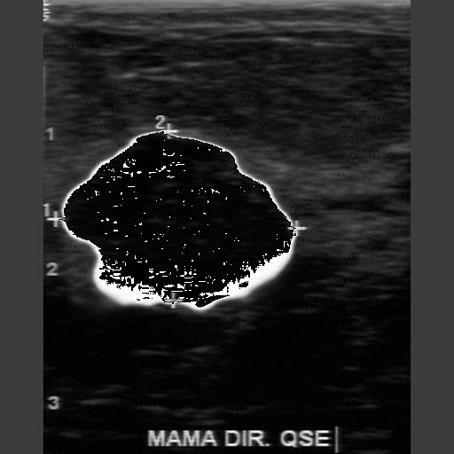
</td> 
</tr>

<tr>
<td>
test/images/0112-l.jpg 
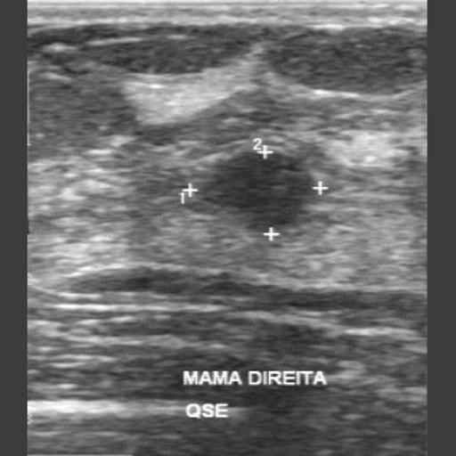

</td>
<td>
Inferred merged/0112-l.jpg 

</td> 
</tr>

<!-- 5-->
<tr>
<td>
test/images/0852-s.jpg 
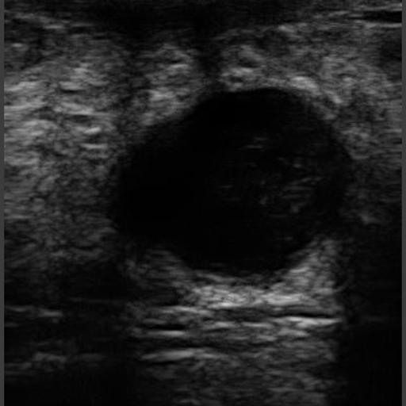

</td>
<td>
Inferred merged/0852-s.jpg 
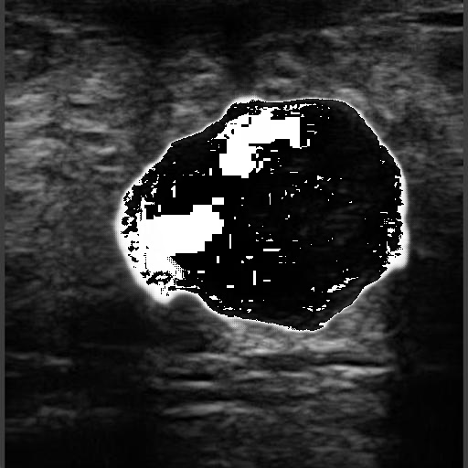
</td> 
</tr>

</table>

<h3>
References
</h3>
<b>1. BUS-BRA: A Breast Ultrasound Dataset for Assessing Computer-aided Diagnosis Systems </b> 
Wilfrido Gómez-Flores, Maria Julia Gregorio-Calas, 
Wagner Coelho de Albuquerque Pereira 
Published March 13, 2023 | Version 1.0 
<pre>
https://zenodo.org/records/8231412
</pre>

<b>2. Breast Cancer Histopathological Images Segmentation Using Deep Learning</b> 
Wafaa Rajaa Drioua, Nacéra Benamrane, and Lakhdar Sais 
Published online 2023 Aug 22. doi: 10.3390/s23177318 
<pre>
https://www.ncbi.nlm.nih.gov/pmc/articles/PMC10490494/
</pre>

<b>3. Improving Breast Cancer Detection and Diagnosis through Semantic Segmentation Using the Unet3+ Deep Learning Framework</b> 
Taukir Alam, ORCID,Wei-Chung Shia, ORCID,Fang-Rong Hsu, ORCID andTaimoor Hassan 
iomedicines 2023, 11(6), 1536; https://doi.org/10.3390/biomedicines11061536 
<pre>
https://www.mdpi.com/2227-9059/11/6/1536
</pre>

<b>4. Image-Segmentation-Breast-Cancer</b> 
Toshiyuki Arai @antillia.com 
<pre>
https://github.com/atlan-antillia/Image-Segmentation-Breast-Cancer

</pre>

